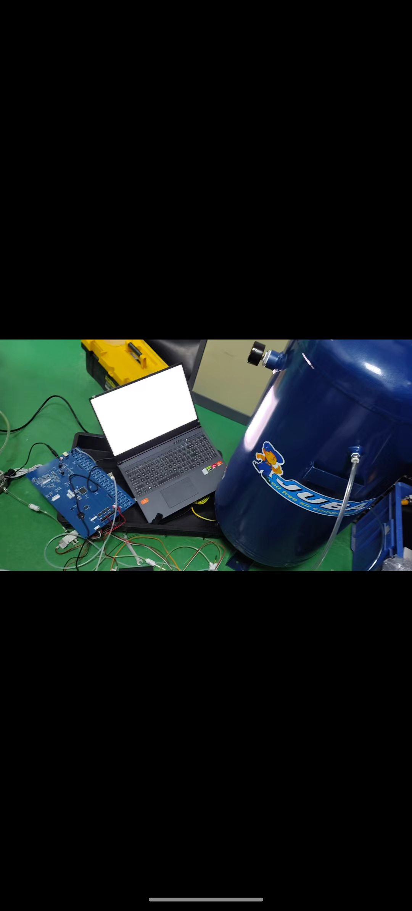
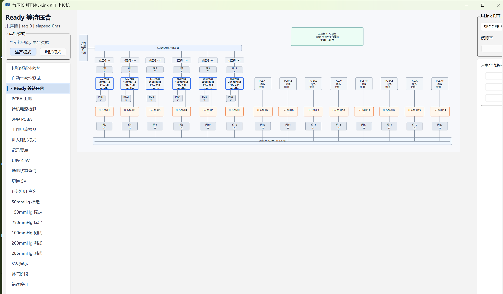

# Air Pressure Testing Fixture

This repository contains the STM32 firmware, Qt host tool, protocol notes, and hardware reference material for an air-pressure production testing fixture.

## Overview

- STM32F103ZET6 lower-controller firmware for valves, pressure sensing, PCBA current checks, USB MSC mode, J-Link RTT control, and the LT768 local display UI.
- Qt host application for production/test operation, including the fixture architecture view and J-Link RTT communication.
- Documentation for the PC-MCU control protocol and fixture logic.

## Host Architecture View

## Repository Layout

- `Firmware/STM32F103ZET6_MDK_HAL/` - Keil MDK firmware project.
- `QtHost/PressureFixtureHost/` - Qt host application and tests.
- `Docs/` - protocol notes and project images.
- `WKS70WSV082-WCT产品资料/` - LCD/module reference material.

## Build Notes

- Firmware project: `Firmware/STM32F103ZET6_MDK_HAL/MDK-ARM/PressureFixture_STM32F103ZET6.uvprojx`
- Qt host project: `QtHost/PressureFixtureHost/PressureFixtureHost.pro`
